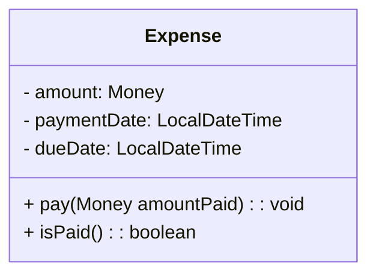
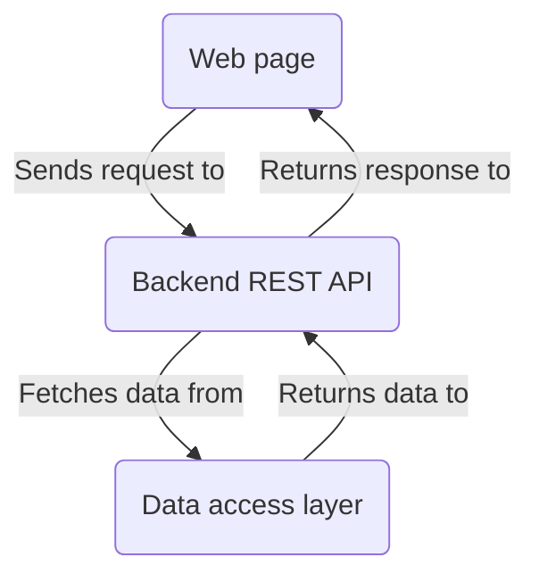

# chremata

_Money... In greek_

## Backend

```mermaid
classDiagram
  class Expense {
    - amount: Money
    - paymentDate: LocalDateTime
    - dueDate: LocalDateTime

    + pay(Money amountPaid): void
    + isPaid(): boolean
  }
```

## Frontend

```mermaid
flowchart TD
  UI("Web page")
  API("Backend REST API")
  DB("Data access layer")

  UI -->|Sends request to| API
  API -->|Returns response to| UI
  API -->|Fetches data from| DB
  DB -->|Returns data to| API
```